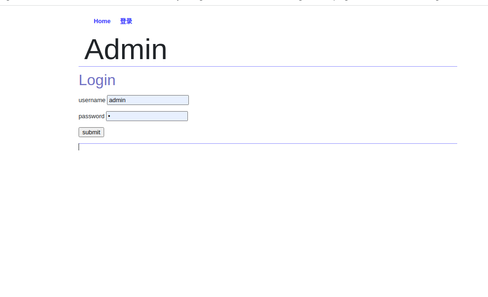
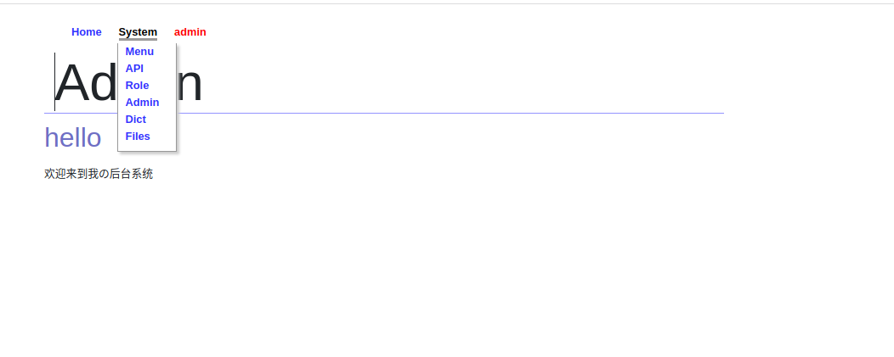
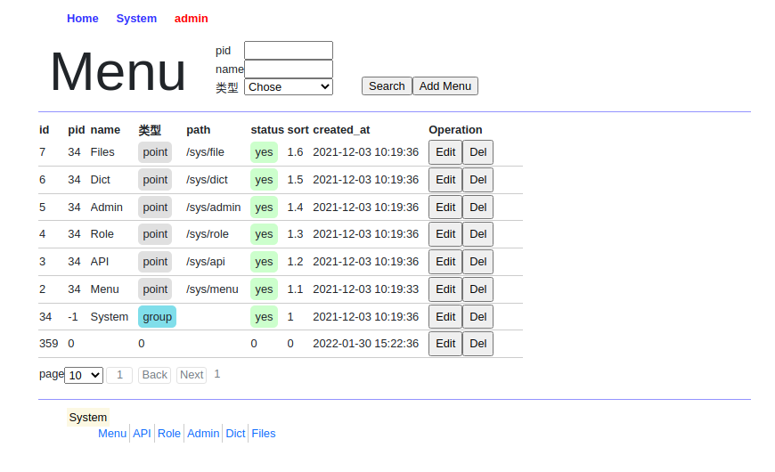
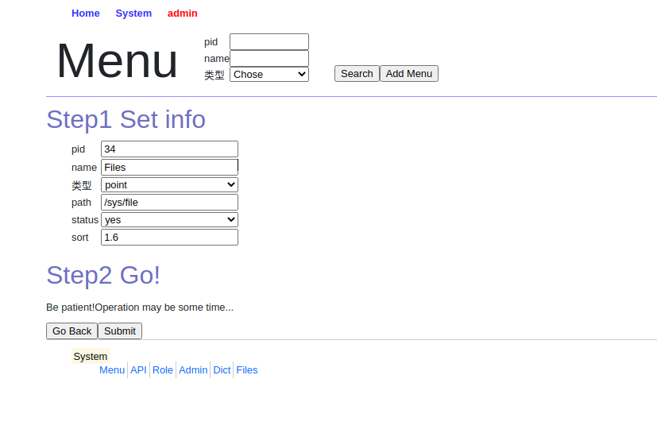

# ciel_admin

锲而舍之朽木不折，锲而不舍金石可镂

登录页面 <br>


导航 <br>


详情页面&底部便捷导航  <br>


修改页面(在同一个文件里，只是设置了隐藏) <br>


## 说明

ciel_admin 是一个简洁的后台管理系统，提供了简单的权限管理功能，和本地文件上传。

前端页面风格参考 https://www.random.org/

使用到的技术如下

- 前端 react,next.js,axios,bootstrap,swr,react-toastify,node-sass
- 后端 goframe v2

真的追求简洁，一个表的CURD 前端+后端代码不到100行。例如菜单页面

### 前端 menu.js

```js
const Menu = () => <DefaultPage
    fields={[
        {field: 'id', editHidden: 1},               // filed 字段名 ,editHidden:编辑时是否隐藏（id一般不允许编辑）                                
        {field: 'pid', search: 1, type: 'number'},  // type: 默认为 input 可不填，可选 number|select(当为select时需要指定items)  
        {field: 'name', search: 1},                 // search: 是否搜索
        {field: 'sort', type: 'number', step: '0.1', detailsDesc: "请给一个排序"}, // detailsDesc  input框的简要说明
        {
            field: 'type', title: '类型', search: 1, type: "select",
            items: [
                {
                    label: 'group',     // 可选时的标签
                    value: 1,           // 对应数据库的值
                    bgGround: "#80deea" // 背景颜色，不给则使用系统自动匹配   
                },
                {
                    label: 'point',
                    value: 2,
                    bgGround: "#e0e0e0"
                }
            ]
        },
        {field: 'path'},
        {field: 'status', type: 'select', items: [{label: 'yes', value: 1}, {label: 'no', value: 2}]},
        {field: 'created_at', editHidden: 1},
    ]} name={'Menu'} urlPrefix={'menu'}/> // name为页面名称  urlPrefix 为后台请求前缀
export default Menu
```

只需要将数据库中使用到字段添加到js中即可。

### 后端 s_menu.go

```go
package controller

var Menu = menu{table: "s_menu"}

type menu struct {
	table string
}

func (c *menu) List(r *ghttp.Request) {
	page, size := res.GetPage(r)
	total, data := service.List(gctx.New(), service.SearchConf{
		Table: c.table,
		Page:  page, Size: size,
		Conditions: []*service.Condition{
			{Field: "id", Value: r.GetQuery("id")},
			{Field: "pid", Value: r.GetQuery("pid")},
			{Field: "type", Value: r.GetQuery("type")},
			{Field: "status", Value: r.GetQuery("status")},
			{Field: "name", Value: r.GetQuery("name"), Like: true},
		},
		OrderBy: "sort desc,id desc",
	})
	res.OkPage(data, total, page, size, r)
}

func (c *menu) Add(r *ghttp.Request) {
	var d entity.Menu
	_ = r.Parse(&d)
	if err := service.Add(gctx.New(), c.table, &d); err != nil {
		res.Error(err, r)
	}
	res.OK(r)
}

func (c *menu) Del(r *ghttp.Request) {
	if err := service.Del(gctx.New(), c.table, xparam.ID(r)); err != nil {
		res.Error(err, r)
	}
	res.OK(r)
}

func (c *menu) Put(r *ghttp.Request) {
	var d entity.Menu
	_ = r.Parse(&d)
	if err := service.Update(gctx.New(), c.table, d.Id, &d); err != nil {
		res.Error(err, r)
	}
	res.OK(r)
}

func (c *menu) GetById(r *ghttp.Request) {
	data, _ := service.GetById(gctx.New(), c.table, xparam.ID(r))
	res.OKData(data, r)
}
```

## 快速启动

1. `git clone git@github.com:1211ciel/ciel-admin.git`
2. 创建数据库 `ciel_admin` 导入 `interface/ciel_admin.sql`
3. 配置  `interface/manifest/config/config.yaml`
4. 运行后后台接口：进入 `interafce` 目录运行 `go mod tidy && gf run main.go`
5. 运行前台      : 进入 `admin` 目录运行 `npm install && npm run dev`
6. 访问 `http://localhost:3000/` 登录 默认用户 `admin` 密码 `1`

当然简洁的背后，主要在于将相同的操作都分装在了两个文件中。

## 项目结构

```text
- interface  后台项目 (goFrame v2)
- admin      前台项目 (nextJs)
```

## 前端主要文件 defaultPage.js

该组件直接调用。如果您对页面有大的修改需求，拷贝该文件到新的进行修改即可。

```js
// defaultPage
const DefaultPage = ({
                         name,      //must 页面标题名
                         fields,    //must 字段信息
                         urlPrefix, //must 请求前缀
                         noEdit,    // option  没有编辑按钮     1则没有 0 或不不传则有编辑按钮
                         noNav,     // option  没有导航条？     同上
                         noSearch,  // option  没有寿搜索按钮？ 同上
                         query,     // option  默认查询参数  用法见 Role角色页面
                     }) => {
    // 获取列表请求
    const fetcher = async ({url, params}) => request({url: url, method: 'get', params}),
        // 修改请求
        update = async (data) => request({url: `/${urlPrefix}/update`, method: 'put', data}),
        // 添加请求
        add = async (data) => request({url: `/${urlPrefix}/add`, method: 'post', data}),
        // 删除请求
        del = async (id) => request({url: `/${urlPrefix}/del?id=${id}`, method: 'delete'})
    // 查询参数
    const [params, setParams] = useState({...defaultPageParam, ...query}),
        // 查询临时参数
        [paramsTemp, setParamsTemp] = useState(params),
        // 修改和添加参数
        [details, setDetails] = useState({showType: "main"}),
        // swr 查询（用法请看 swr官网）
        {data, mutate} = useSWR({url: `/${urlPrefix}/list`, params: params}, fetcher),
        // 返回数据
        {currPage, list, totalPage, totalCount} = data ? data.data : ""
    // 到用到 query时将查询参数添加到 params中
    useEffect(() => setParams({...params, ...query}), [query])
    // 搜索操作
    const onSearch = () => setParams(paramsTemp),
        // 查询临时参数变动时
        onChange = (e, name) => setParamsTemp({...paramsTemp, [name]: e.target.value}),
        // 修改和添加参数变动时
        onDetailsChange = (e, name) => setDetails({...details, [name]: e.target.value}),
        // 搜索键盘事件enter事件 
        onKeyDown = (e) => (e.key === 'Enter') ? params.page = 1 && onSearch() : "",
        // 删除操作
        onDelete = async (id) => (confirm("Are you sure?")) ? await del(id) && toast('ok') && mutate() : "",
        // 添加或修改操作
        onSubmit = async () => {
            let {code, msg} = details.showType === "update" ? await update(details) : await add(details) // 判断修改还是添加
            if (code === 0) {
                toast(msg)
                mutate()
                setDetails({showType: "main"})
            }
        }
    let tbody = ''
    let search = <ul>// 搜索部分
        {fields.filter(item => item.search).map(item =>
            <SearchLi key={item.field}
                      field={item.field} label={item.title}
                      type={item.type} items={item.items}
                      onChange={onChange} paramsTemp={paramsTemp} onKeyDown={onKeyDown}
            />
        )}
    </ul>
    if (list) { // 当数据存在则填充tbody
        tbody = list.map(item => <tr key={item.id}>
            {fields.filter(item => !item.hidden).map(i => (<TableTd key={i.field + 's'} value={item[i.field]} type={i.type} items={i.items}/>))}
            <td>
                <input hidden={noEdit} type={'submit'} value={'Edit'} onClick={() => setDetails({...item, showType: "update"})}/>
                <input type={'submit'} value={'Del'} onClick={() => onDelete(item.id)}/>
            </td>
        </tr>)
    }
    return <>
        <Meta/>
        {noNav ? '' : <Nav/>}
        <header className={' hr'}>
            <h1>{name}</h1>
            <section>
                {search}
                <ul>
                    <input hidden={noSearch} type="submit" value={'Search'} onClick={() => onSearch()}/>
                    <input type="submit" value={`Add ${name}`} onClick={() => setDetails({showType: "add", rid: ''})}/>
                </ul>
            </section>
        </header>
        // 主数据区域
        <main className={' hr'} hidden={!(details.showType === "main")}>
            <table>
                <thead>
                    <tr>
                        {[...fields.filter(item => !item.hidden), {field: "Operation"}].map(item =>
                            <th key={item.field}>{item.title ? item.title : item.field} </th>)}
                    </tr>
                </thead>
                <tbody>{tbody}</tbody>
                <TableFooter params={params} setParams={setParams} current={currPage} tCount={totalCount} tPage={totalPage}/>
            </table>
        </main>
        // 修改和添加区域默认隐藏
        <section className={'details'} hidden={!(details.showType === "add" || details.showType === "update")}>
            <h2>Step1 Set info</h2>
            <section>
                <ul> {fields.filter(item => !item.editHidden).map(item =>
                    <DetailsLi2
                        key={item.field} field={item.field} type={item.type} details={details} onDetailsChange={onDetailsChange}
                        label={item.title} placeholder={item.detailsDesc}
                        items={item.items} step={item.step} height={item.detailsHeight}
                    />)}
                </ul>
            </section>
            <h2>Step2 Go!</h2>
            <p>Be patient!Operation may be some time...</p>
            <input type={'button'} value={'Go Back'} onClick={() => setDetails({showType: "main"})}/>
            <input type={'button'} value={'Submit'} onClick={onSubmit}/>
        </section>
    </>
}
export default DefaultPage
```

### 后端

#### 路由注册

添加新的数据表时才此文件进行注册

```go
package cmd

var (
	Main = gcmd.Command{
		Name:  "main",
		Usage: "main",
		Brief: "start http server",
		Func: func(ctx context.Context, parser *gcmd.Parser) (err error) {
			s := g.Server()
			s.BindMiddlewareDefault(ghttp.MiddlewareHandlerResponse, middleware.CORS)
			s.Group("/menu", func(g *ghttp.RouterGroup) {
				g.Middleware(middleware.Auth)
				g.GET("/list", controller.Menu.List)
				g.GET("/getById", controller.Menu.GetById)
				g.Middleware(middleware.LockAction)
				g.POST("/add", controller.Menu.Add)
				g.PUT("/update", controller.Menu.Put)
				g.DELETE("/del", controller.Menu.Del)
			})
			s.Group("/api", func(g *ghttp.RouterGroup) {
				g.Middleware(middleware.Auth)
				g.GET("/list", controller.Api.List)
				g.GET("/getById", controller.Api.GetById)
				g.Middleware(middleware.LockAction)
				g.POST("/add", controller.Api.Add)
				g.PUT("/update", controller.Api.Put)
				g.DELETE("/del", controller.Api.Del)
			})
			// ...
			s.Run()
			return nil
		},
	}
)

```

#### controller

```go
package controller

var Menu = menu{table: "s_menu"}

type menu struct {
	table string
}

func (c *menu) List(r *ghttp.Request) {
	page, size := res.GetPage(r)
	total, data := service.List(gctx.New(), service.SearchConf{
		Table: c.table,
		Page:  page, Size: size,
		Conditions: []*service.Condition{
			{Field: "id", Value: r.GetQuery("id")}, //如果有新的查询需求在此处添加即可
			{Field: "pid", Value: r.GetQuery("pid")},
			{Field: "type", Value: r.GetQuery("type")},
			{Field: "status", Value: r.GetQuery("status")},
			{Field: "name", Value: r.GetQuery("name"), Like: true},
		},
		OrderBy: "sort desc,id desc", // 排序规则 默认 `desc id`
	})
	res.OkPage(data, total, page, size, r)
}
func (c *menu) Add(r *ghttp.Request) {
	var d entity.Menu
	_ = r.Parse(&d)
	if err := service.Add(gctx.New(), c.table, &d); err != nil { // 调用通用 service添加方法 (若有其他业务则创建对应的service文件即可)
		res.Error(err, r)
	}
	res.OK(r)
}

func (c *menu) Del(r *ghttp.Request) {
	if err := service.Del(gctx.New(), c.table, xparam.ID(r)); err != nil { // 同上
		res.Error(err, r)
	}
	res.OK(r)
}

func (c *menu) Put(r *ghttp.Request) {
	var d entity.Menu
	_ = r.Parse(&d)
	if err := service.Update(gctx.New(), c.table, d.Id, &d); err != nil { // 同上
		res.Error(err, r)
	}
	res.OK(r)
}

func (c *menu) GetById(r *ghttp.Request) { // 同上
	data, _ := service.GetById(gctx.New(), c.table, xparam.ID(r))
	res.OKData(data, r)
}
```

### 后端主要文件公共service方法

如果没有特殊需求，只需要写 `controller` 和`cmd` 路由注册文件即可，因为所有 `controller` 层都可以调用该通用`service` 方法

```go
package service

type Condition struct {
	Field string      // 需要搜索的字段
	Value interface{} // 具体值
	Like  bool        // false:where true: whereLike 
}
type SearchConf struct {
	Table      string       // 表名
	Page, Size int          // 页数和大小
	Conditions []*Condition // 查询条件
	OrderBy    string       // 排序方式
	FieldsEx   string       // 过滤的字段
}

// 新添查询条件方法
func QueryCondition(filed string, r *ghttp.Request, like ...bool) *Condition {
	condition := Condition{Field: filed, Value: r.GetQuery(filed)}
	if len(like) > 0 {
		condition.Like = true
	}
	return &condition
}

// 通用List查询
func List(ctx context.Context, s SearchConf) (int, gdb.List) {
	db := g.DB().Model(s.Table).Ctx(ctx)
	if len(s.Conditions) > 0 {
		for _, item := range s.Conditions {
			if g.IsEmpty(item.Value) {
				continue
			}
			if item.Like {
				db = db.WhereLike(item.Field, xstr.Like(gconv.String(item.Value)))
			} else {
				db = db.Where(item.Field, item.Value)
			}

		}
	}
	count, _ := db.Count()
	var o = "id desc"
	if s.OrderBy != "" {
		o = s.OrderBy
	}
	if s.FieldsEx != "" {
		db.FieldsEx(s.FieldsEx)
	}
	all, _ := db.Limit(s.Size).Offset((s.Page - 1) * s.Size).Order(o).All()
	if all.IsEmpty() {
		return 0, gdb.List{}
	}
	return count, all.List()
}

// 通用根据ID查参数方法
func GetById(ctx context.Context, table, id interface{}) (gdb.Record, error) {
	one, err := g.DB().Ctx(ctx).Model(table).One("id", id)
	if err != nil {
		glog.Error(ctx, err)
		return nil, err
	}
	return one, nil
}

// 通用添加方法
func Add(ctx context.Context, table, data interface{}) error {
	_, err := g.DB().Ctx(ctx).Model(table).Insert(data)
	if err != nil {
		glog.Error(ctx, err)
		return err
	}
	return nil
}

// 通用删除方法
func Del(ctx context.Context, table, id interface{}) (err error) {
	if _, err = g.DB().Ctx(ctx).Model(table).Delete("id", id); err != nil {
		glog.Error(ctx, err)
		return
	}
	return
}

// 通用修改方法
func Update(ctx context.Context, table string, id, data interface{}) error {
	_, err := g.DB().Update(ctx, table, data, "id", id)
	if err != nil {
		glog.Error(ctx, err)
		return err
	}
	return nil
}

```

## 主要框架使用

- GoFrame  https://goframe.org/display/gf
- React https://reactjs.org/
- nextjs https://nextjs.org/
- SWR https://swr.vercel.app/zh-CN/docs/getting-started

